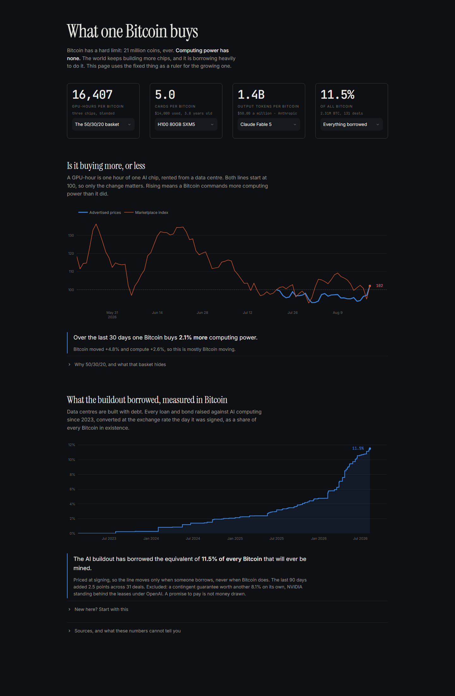

# BIPP Streamlit app

Bitcoin Compute Infrastructure Purchasing Power.

This is financial methodology and visualization tooling, not investment advice.

## Two apps

`app.py` is **v1**: composite GPU-hours per BTC, priced off Ornn's `index_value`.
Unchanged, so v2 has something to be compared against.

`app_v2.py` is **v2**: the same question priced off CCIR (ccir.io), plus the
three other prices of compute that CCIR publishes.

## Live app (v1)

https://bipp-appgit-ch4gsg26dv9hmumykniewu.streamlit.app/

## Run locally

```powershell
py -3 -m pip install -r requirements.txt
py -3 -m streamlit run app.py
py -3 -m streamlit run app_v2.py --server.port 8502
```

## Why v2 exists

v1 cannot tell a compute-price move apart from a data artifact. Ornn returns a
bare `index_value` with no unit, no source count, and no revision status, so a
change in the panel behind the number looks exactly like a change in the market.

CCIR publishes USD per GPU per hour with per-cell metadata: source count,
interquartile range, concentration, confidence level, and promotion status.
v2 uses that metadata to quarantine bad readings rather than charting them.

Worked example: on 2026-07-25 the hyperscaler B200 on-demand series fell 62.6
percent in one day and then resumed a smooth trend. Built on that surface, the
30-day BIPP reads 135.6. Built on the neocloud on-demand surface over the same
days with the same BTC leg, it reads 101.6. v2 flags the first as a panel jump.

## What v2 adds

**Price surface selection.** A composite GPU-hour price hides operator tier,
form factor, interruptibility, commitment term, and region. CCIR series IDs
carry all five, so the sidebar picks a market rather than blending several.

**A sensitivity table.** BIPP under every defensible surface at once, with the
spread and a warning when the sign flips across them.

**A weight-free view.** Every citable series restated as GPU-hours per BTC. The
unmeasured 50/30/20 basket question does not enter these numbers at all.

**Three more axes, all in BTC.** Rent is one price of compute. v2 adds own
(secondary-market cards), produce (token prices), and borrow (the GPU-backed
debt tracker). They do not have to move together, and the gaps are the point.
`payback_hours` bridges rent and own: hours of rental revenue needed to recover
a card's current resale price.

**A fixed rebasing bug.** v1 resolves the base date against the windowed frame,
so switching 30D to 90D silently rebases the index. v2 resolves it against the
full frame. `tests/test_ccir.py::test_base_date_is_resolved_before_windowing`
pins the behavior.

## Do not average v1 and v2

Their daily changes are near-uncorrelated (measured between -0.17 and +0.20
depending on chip and tier). Averaging two uncorrelated series lowers variance
by cancellation, which would make BIPP look steadier than BTC for a purely
arithmetic reason. That is the exact hypothesis the tool exists to test, so a
blend would manufacture its own answer. v2 charts both and reports the
correlation instead.

## v3: BTC and the cost of compute

`app_v3.py` is the current build. Four panels, in the order they answer things:

1. **Compute per BTC.** The original chart, rebuilt on CCIR with dispersion bands
   and panel-jump quarantine, plus the Ornn leg for the 92 days that reach back
   past the 2026-06-30 BTC low. CCIR history begins 2026-07-21, three weeks after
   that low, so it cannot see the divergence this project exists to watch.
2. **Cost of locking capacity.** Committed-to-on-demand ratio and the full term
   curve. The cheapest honest read available: no capex estimate, no opex
   assumption, no residual sample. H100 SXM is 2.69/3.57 = 0.75 today.
3. **Carry vs financing.** Does the asset earn more than its debt costs.
4. **Credit.** SOFR spread by issue vintage against notional.

```powershell
py -3 -m streamlit run app_v3.py --server.port 8503
```

### The depreciation basis is a control, not a constant

A Grok 4.6 review on 2026-08-19 established that the depreciation basis alone
flips the sign of the carry answer. On an H100 80GB SXM5 at the 3-year committed
rate, 90% billed, 45% opex, 6.88% cost of debt:

| Depreciation basis | Net yield | Carry |
|---|---|---|
| Used-price age curve (20.6%/yr) | 10.1% | **+3.2pp** |
| Covenant amortization (33%/yr) | -2.7% | **-9.6pp** |

CCIR reports that no GPU-collateralized instrument in its tracker references a
market residual, and every disclosed schedule amortizes collateral toward zero
on a three-to-four year cash clock. So covenant is the default and the used-price
curve is the option, not the reverse. `tests/test_economics.py` pins both numbers.

Two further corrections from that review, both verified against the data:

- **Rate and utilization are one choice, not two.** On-demand list does not come
  with 90% billed hours; a committed book does. Priced in matching pairs the rate
  costs about 4pp of carry. Mispairing the committed rate with on-demand occupancy
  flips the sign on its own, which is a trap the tests document.
- **Form factor was blended.** v2 used one $3.48 H100 rate for SXM5, PCIe and NVL
  cards. CCIR publishes them separately ($3.57 SXM, $3.30 PCIe). The apparent
  14pp yield spread between those cards was entirely the residual mark, on samples
  of 9 and 4 sold units. Under covenant depreciation the spread vanishes, because
  they are the same business.

One claim in that review did not survive checking: it reported the H100 on-demand
median as $3.00 against a $3.48 mean, implying a 14% overstatement. The published
median is $3.4051. The gap is 2%.

## v4: What one Bitcoin buys

`app_v4.py` is the current build. One page, no tabs, everything denominated in
BTC. Built for spotting trend changes and divergences.

```powershell
py -3 -m streamlit run app_v4.py --server.port 8504
```

Four facts and two charts:

- **What one BTC buys right now**: GPU-hours, H100 cards, frontier output tokens,
  and the share of all Bitcoin borrowed against compute.
- **Is it buying more or less.** CCIR's posted-ask series and Ornn's marketplace
  index layered on one indexed axis, both rebased to the day CCIR's record starts
  so the Ornn line carries the two months of history CCIR does not have. BTC/USD
  is not plotted; it appears only in the sentence underneath, which splits the
  move into its money half and its compute half. Purchasing power is BTC divided
  by the compute price, so that split is exact.
- **How much of all Bitcoin the world has borrowed to buy compute.** Every deal
  converted at the BTC price on its own issue date, cumulative since 2023, as a
  percentage of circulating supply. Issue-date pricing means the line moves only
  when someone borrows, never when Bitcoin does.

### The four cards are selectable

Each card in the top strip picks its own subject, so anything CCIR prices can be
read in BTC:

| Card | Choose from | Range today |
|---|---|---|
| Rent | the 50/30/20 basket or any single chip | 10,117 (B300) to 19,231 (H100) GPU-hours per BTC |
| Own | any of 11 cards in the residual table | 2.5 (H200 141GB) to 274.8 (V100 16GB) cards per BTC |
| Produce | any of 79 models | 0.38B (gpt-5.5-pro) to 2.3T (GLM-OCR) output tokens per BTC |
| Borrow | everything borrowed, secured only, or contingent guarantees | 11.5%, 6.6%, 8.1% of all Bitcoin |

Each carries a help tooltip with what the number means and what it does not.
The rent card offers only chips that resolve to exactly one series on the
selected surface; A100 has two (40GB and 80GB carry separate ids) so it is
filtered out rather than left in the list showing "n/a".

The token spread is the striking one: 6,000x between the priciest and cheapest
model. What one Bitcoin buys depends far more on which model you ask than on
anything Bitcoin does.

### Looking at it

`bipp/theme.py` carries the styling: Streamlit's header, hamburger and footer
hidden, one 1080px column instead of a full-bleed left margin, Instrument Serif
for headings, Inter for prose, JetBrains Mono for every number so digits line up
between cards. Charts lose the modebar and take their text colour from the theme.
`.streamlit/config.toml` sets the dark surface so the app does not depend on the
viewer's Streamlit preference.



**Two traps worth writing down.** A `<style>` block passed through `st.markdown`
ends at the first blank line, because markdown terminates an HTML block there:
every rule after that blank line prints as visible text on the page. Keep the CSS
free of blank lines. And Streamlit's expander border lives on the inner
`<details>`, not on `[data-testid="stExpander"]`, so styling the wrapper does
nothing.

`scripts/screenshot.py` captures the running app. Chrome's `--screenshot` with
`--virtual-time-budget` photographs Streamlit's skeleton loader, because content
arrives over a websocket that virtual time never advances; this drives Chrome
over the DevTools Protocol instead, polls the DOM until the numbers and charts
have actually painted, and measures the Streamlit scroll container rather than
`document.body`, which reports zero.

```powershell
py -3 scripts/screenshot.py http://localhost:8504 shot.png 1440 55
```

### Written for someone who has never heard of a GPU-hour

The page opens with a lede that frames the whole thing (fixed money as a ruler
for a growing thing), each section carries a plain-English paragraph explaining
what it measures, and a "New here? Start with this" expander defines Bitcoin,
GPU, GPU-hour, token, and neocloud, then says why any of it matters and how to
read an indexed chart.

The 50/30/20 basket has its own expander: what the three chips are, why the
weights lean towards H100, and the admission that **the weights are reasoned,
not measured**, since nobody publishes actual deployment shares. It also flags
that the basket averages prices and then converts, rather than averaging hours,
which gives a slightly different number (16,153 versus 16,885 today) because the
average of reciprocals is not the reciprocal of the average.

### Which models, and which chips

**Models are a curated list, not a rule.** `FLAGSHIPS` in `bipp/ccir_pages.py`
names ten models in order, strongest lab first, Claude Fable 5 leading. Ranking
by posted price was tried and abandoned: it surfaced a Google robotics build and
a Moonshot code-speed variant as flagships, and it cannot know that a cheaper
model is the one people actually use. Ordering is a judgement about which lab
sets the standard, so it lives in one editable list rather than in a heuristic.
A name CCIR stops publishing drops out silently rather than breaking the list.

Anthropic (Fable 5, Opus 5, Sonnet 5), OpenAI (sol, terra, luna), Google
(gemini-3.1-pro), xAI (grok-4.6), DeepSeek (v4-pro), Moonshot (kimi-k3).

There is no qwen 3.8. Alibaba's top posted model is qwen3.7-max.

**Chips price on a fallback ladder.** The page's default surface is neocloud SXM
on demand, which is the cleanest read on datacentre compute but has no consumer
cards at all: a 3090 is listed only by marketplaces and never in an SXM form
factor. `best_rate()` tries neocloud SXM, then neocloud, then marketplace, then
hyperscaler, takes the first rung that resolves to exactly one series, and
reports which rung answered. Ambiguity returns nothing rather than averaging two
series.

That takes the rent card from 5 chips to 18, spanning a 3090 at $0.20 an hour
(335,000 hours per Bitcoin) to a B300 at $6.79 (10,100 hours).

**Cards per Bitcoin stays datacentre-only.** CCIR publishes no secondary-market
price for consumer hardware, and Ornn covers only six GPUs (H100 SXM, H200,
A100 SXM4, RTX 5090, B200, RTX PRO 6000 WS) as a rental index rather than card
prices. So there is no source for what a Bitcoin buys in home hardware, and the
card says so instead of guessing.

### Written for someone who has never heard of a GPU-hour

The page opens with a lede that frames the whole thing (fixed money as a ruler
for a growing thing), each section carries a plain-English paragraph explaining
what it measures, and a "New here? Start with this" expander defines Bitcoin,
GPU, GPU-hour, token, and neocloud, then says why any of it matters and how to
read an indexed chart.

The 50/30/20 basket has its own expander: what the three chips are, why the
weights lean towards H100, and the admission that **the weights are reasoned,
not measured**, since nobody publishes actual deployment shares. It also flags
that the basket averages prices and then converts, rather than averaging hours,
which gives a slightly different number (16,153 versus 16,885 today) because the
average of reciprocals is not the reciprocal of the average.

### Frontier models only

The token card used to offer all 79 rows CCIR publishes. CCIR's own "Frontier
posted" heading is a *construction* (the owner published the price), not a
capability tier, so it carries OCR models, embedding models and dated legacy
snapshots beside flagships.

`frontier_models()` takes the highest-priced current model from each lab that
ships a frontier-class general model, which recovers the capability tier without
hand-maintaining a list. Seven models, one per lab: gpt-5.5-pro, Claude Mythos 5,
kimi-k3, gemini-3.1-pro-preview, grok-4.6, muse-spark-1.2, deepseek-v4-pro.

Two defaults were wrong before they were right. Taking the top *two* per lab let
in a Google robotics model and a Moonshot code-speed build; one per lab fixes it.
And defaulting to the head of the list anchored the headline on OpenAI's $180
premium reasoning tier, six times the flagship beside it, so the default is now
the median.

### Guarantees are not borrowing

CCIR's tracker mixes drawn debt with contingent obligations. On 2026-08-17 it
recorded an NVIDIA residual-value guarantee on the PORTS-Pike leases behind
OpenAI, a payment obligation capped at $105B. At that day's BTC that is 1.63M
BTC-equivalent, which was **41% of the entire cumulative series** and 82% of the
prior 90 days: one row, and it produced the near-vertical spike an earlier build
shipped.

A guarantee pays only if the leases go wrong. It is not money drawn, so
`split_contingent` separates it and the chart reports it beside the line rather
than inside it. Borrowed-only totals 11.5% of circulating supply; the guarantee
is another 8.1% on its own.

### Our own history

CCIR retains about 30 days of rental history and publishes residuals, tokens and
debt as snapshots with no history at all. `scripts/snapshot.py` appends each pull
to `data/history/*.csv`, append-only, so a row already on record is never
rewritten and a re-run the same day is a no-op. Run it daily and commit:

```powershell
py -3 scripts/snapshot.py
```

The app merges the store over the live pull with stored rows winning, so an
upstream restatement cannot rewrite history already captured. The first capture
took the whole 30-day CCIR window plus first snapshots of the other three
surfaces. Once this has run for a while the record is longer than CCIR's, and the
three snapshot-only surfaces become series.

### What still cannot be charted

Token prices have no trend. Only four of 63 tracked models have repriced since
CCIR's record began on 2026-07-03 (OpenAI cut terra 20% and luna 80% on
2026-07-30; DeepSeek raised v4-flash 371% and v4-pro 355% on 2026-08-17). The
page shows a level and says so rather than drawing a flat line. The store fixes
this going forward, not backwards.

### Chart construction

Colors are the dataviz reference palette slots 1 and 2, validated in both light
and dark (worst adjacent CVD delta-E 9.2 light, 9.4 dark). No dual-axis charts.
Chart text colour is left to the active Streamlit theme rather than hardcoded.
Circulating supply is computed from block height via the issuance schedule, so
it needs no supply oracle and cannot drift with a third-party figure.

## Data sources and limits

| Axis | Source | Feed | History |
|---|---|---|---|
| Rent | CCIR rates | CSV | ~30 days |
| Own | CCIR hardware | scraped HTML | snapshot |
| Produce | CCIR tokens | scraped HTML | snapshot |
| Borrow | CCIR credit | scraped HTML | snapshot |
| BTC/USD | Coinbase | JSON | 300-candle cap |

- `https://ccir.io/data/rates_history.csv` is not linked anywhere on the site.
  It resolves and robots.txt permits it, but it is undocumented and can vanish.
- 30 days is short. Base-date choice dominates any reading over that span.
- The three scraped axes have no data contract and can break on a redesign.
  Each parser returns an empty frame rather than a wrong one, and the app says
  so on screen.

## Data boundaries

- Do not commit raw Ornn API responses, CCIR CSVs, or scraped pages.
- Do not publish derived BIPP values unless Ornn permission scope is preserved.
- Attribute CCIR data as `CCIR (ccir.io)` with series identifier and publication
  date. Their terms permit non-commercial quotation and citation with
  attribution; systematic retrieval, redistribution of series history, and
  derived commercial products need written permission at research@ccir.io.
  Local personal research sits inside the permitted use, which is why v2 is a
  local app rather than a deploy.
- Do not describe BIPP as direct intelligence output. The token axis is posted
  output pricing, not model quality.
- Label the rental metric as compute infrastructure purchasing power.
